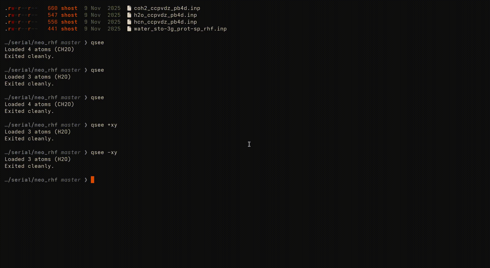

# qsee - ChronusQ Input File Visualizer

A terminal-based molecule visualizer for ChronusQ input files (`.inp`). Features animated 3D rendering using the Kitty graphics protocol.



## Requirements

- **Kitty terminal** (or another terminal supporting the Kitty graphics protocol)
- **g++** with C++17 support
- **fzf** (installed automatically by the installer)

## Installation

1. Clone the repository:
   ```bash
   git clone https://github.com/yourusername/qsee.git
   cd qsee
   ```

2. Run the installer:
   ```bash
   ./install.sh
   ```
## Usage

```bash
# Visualize a specific file
qsee path/to/input.inp

# Interactive file picker (searches for .inp files)
qsee

# View specific plane
qsee input.inp -xy   # XY plane (looking down Z-axis)
qsee input.inp -xz   # XZ plane (looking down Y-axis)
qsee input.inp -yz   # YZ plane (looking down X-axis)
```

Press `Ctrl+C` to exit the visualization.

## Supported Input Format

qsee parses ChronusQ-style input files:

```ini
# Title comment
[Molecule]
charge = 0
mult = 1
geom:
  H  0.0  0.0  0.0
  H  0.0  0.0  0.74

[QM]
reference = RHF

[BASIS]
basis = 6-31G(D)
```

## Manual Build

```bash
g++ -std=c++17 -O2 -o qsee_exe qsee.cpp Input.cpp -lm
```

## License

MIT License
